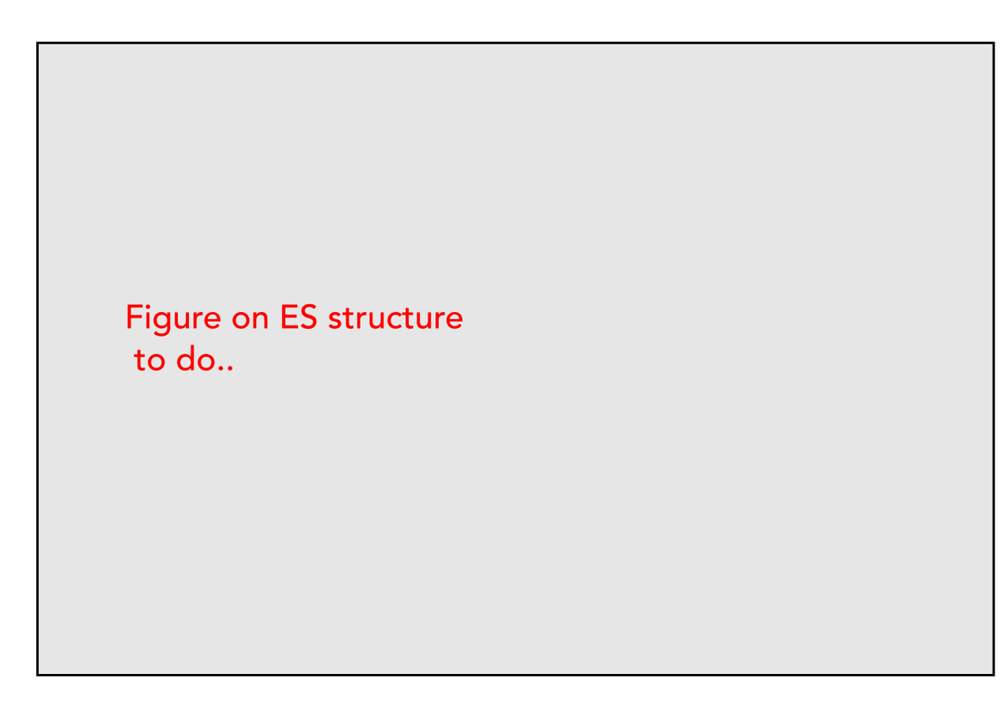
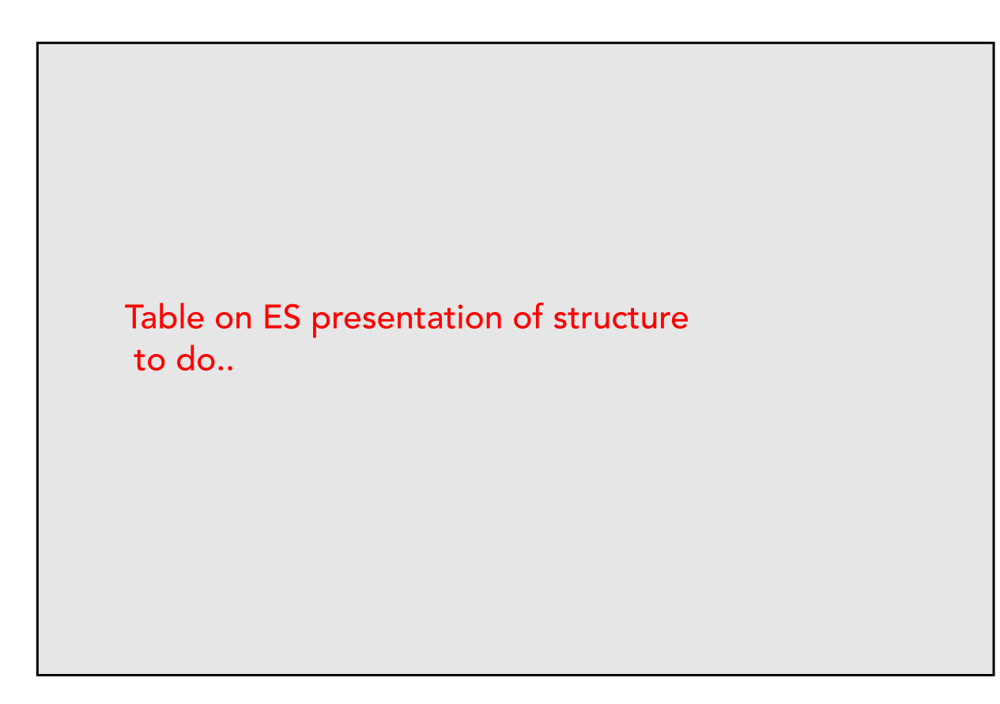

```{r setup, include=FALSE}
knitr::opts_chunk$set(echo = FALSE, fig.retina = 3, message = FALSE, warning = FALSE, out.width='100%')
options(knitr.kable.NA = '')
#options(tinytex.engine_args = '--shell-escape')

library(readxl)
library(here)
library(tidyverse)
library(flextable)
library(rsvg)
set_flextable_defaults(fonts_ignore=TRUE)

#URL for Figurs
URL = c('https://raw.githubusercontent.com/fabbiocrux/Figures/main/')

```

\linenumbers
<!-- \onehalfspacing -->


# Introduction

<!-- ## Ecosystems services in the industrial systems: towards a reconciliation of two capitals for humanity. -->
<!-- Intro -->
The current ecological urgency confirms that the understanding and managing the interactions between humans systems and the rest of nature is a major prerequisite for addressing the worsening environmental and social crises of the $21^{st}$ century [@Lomborg2020].
<!-- Technological development claiming sustainabiilty -->
Even though engineering products and processes might meet the needs of the present, many of the technological developments are compromising the ability of future generations to meet their own needs [@ref].
For claiming for sustainability in technological development and interventions, the human activities should not exceed critical ecosystem capacity  [@Bakshi2018]. 
This meta-principle is a imperative but not sufficient condition for sustainability.
Moreover, no country currently meets minimum thresholds for social development without exceeding planetary boundaries [@ONeill2018].
Therefore, it is no possible to rely only on techno-centric interventions without considering the finite planetary ecosystem characterized by profound uncertainty and the shared goals of ecological sustainability and just distribution [@ref].
We need to integrate ecological carrying capacity since the fuzzy front end phase of an industrial systems. 
<!-- Gap in the literature -->
However, the integration of ecological aspects in the decision-making seems not evident given the complexity to define the boundaries and interactions of industrial and ecological systems.


<!-- Sustainability frameworks -->
@Ceschin2016 putted forward the evolution of *Design for Sustainability (DfS)* framework showing the different approaches that have evolved from a product innovation level to socio-technical systems level. 
They pointed out that engineering interventions at only technological unit operation/product level are necessary, but not sufficient condition for sustainability.
<!-- They hightligthed that differens Systemic design approaches are   -->

<!-- Importance of ES in the Engineering -->
The economic valuation of ecosystem goods and services gives an elegant framework highlighting their importance for society and human welfare. 
However, there is a need to explicitly account for their contribution when designing and developing products and services [@Diwekar2021].
  <!-- Engineering blindness -->
The engineering discipline developed the implicit assumption that ecological systems have nearly endless capacity  to provide resources and adsorb wastes.
This blindness in the engineering vision can be explaining by the fact that at the beginning of the technological industrialization, the  human activites' impacts on the earth remained marginal. This scenario is not true today.
  <!-- Engineering withing ecological constraints -->
The need for ecosystem services research has become evident due to the impacts of population growth, economic activities, and urbanization on natural capital [@Torres2021].
 <!-- Importance of ES in the decision making process -->
The loss in value associated with biodiversity loss and the related loss of ecosystem services is often invisible and does not influence decision makers [@Bruel2018]. 
It is difficult to provide information about pressure from industrial systems in corporate information systems. 
Engineering within ecological constraints need to acknowledge the capacity of relevant ecosystems to supply the demanded goods and services while the ecosystems and natural capital must be protected, restored and developed to be capable of continuing to supply those services that industry (and society) relies on [@Bakshi2018].


  <!-- MEA and Planeatry results -->
According to the Milleniums 15 out of 24 ecosystems services examined are degraded or being used in an unsustainable manner [@MEA2005]. 
Likewise, using the  planetary boundaries framework, it is argued that anthropogenic activities already exceed the biophysical limits of the "safe operating zone" in terms of carbon and nitrogen cycles, and biodiversity loss [@Rockstrom2009; @ONeill2018].
  <!-- Causas of exceeding Planeatry boundaries -->
Among the root causes of ecological degradation is ignorance about the exceed of the ecological carrying capacity in many decisions [@Liu2019g; @Rodrigues2021].
Another crucial issue is that current design approaches based on life cycle characterization and footprint methods focus on continuous improvement by reducing life cycle impacts per unit of product, encouraging improvements by doing "less bad", which need not translate into keeping human activities within ecological constraints.
<!-- Purpose of strong sustainability -->
Ideally, it is needed to (re)designed industrial activities to reduce the demand for the demand of ecosystems services creating for a local '*island of sustainability*' [@Wallner1996] which is that the demand should not exceed the supply at the local scale [@Gopalakrishnan2016]. 
  <!-- Expand boundaries of Engineering -->
Therefore, it's urgent to expand the boundaries for engineering design from the lowest molecular level to the process level, and from individual process to the higher levels of value chains, ecosystems and the planet [@Martinez-Hernandez2017].


  <!-- TES -->
@Bakshi2015 reported a framework of Techno-Ecological Synergy (TES) in order to expand the scope of the usual techno-centric perspectives.
The main point argued is that TES develops ways of enhancing synergies between a local scale manufacturing process and the land around it.
The final aims is to encourage a more robust analysis of technological and ecological systems at multiple spatial scales ranging from local (e.g. for small systems such as a house and its yard, a manufacturing process and its site) to a larger scale systems that extend to consider the entire life cycle. 


<!-- The key point for bussiness and government sectors in terms realize an integrated valuation and comprehensive account of both the negative impacts on ES from business activites and the positive contributions of ES to business and households [@Costanza2017]. -->
<!-- More general, the critical issues relies on the importance of ES to challenge the conventional approaches to growth and development, towards a perspective more focalized on the prosperity and wellbeing.  -->

\textcolor{red}{
Based on this background, in the following section a methodlogy will be presented in the analysis of the  To complete ...} 


The main purpose of this article is to propose a methodology in order to evaluate the techno-ecological synergy with identifying relative and absolute sustainability aspect of prospective industrial systems. 
This methodology is based in the integration of the ecosystem services supply and demand analysis with the purpose to identify scenarios and design improvements. 
  <!-- Case study -->
As a case application, the study of distributed recycling manufacturing will be describe.
Plastic pollution is a global concern that must be addressed collectively with the utmost priority because it endangers the ecosystem and all life forms [@Kumar2021].
Therefore, new approaches need to be explored in order to reduce ar at least recycling this material. 
Thus, this study intends to explore the local impact derived from the implementation of a distributed plastic recycling chain in a territory. 

The expected results seek to address the following questions: 

- What are the appropriate ecosystem service indicators for assessing an prospective filière as distributed plastic recycling? 
- How does the implementation of a distributed plastic recycling chain impact on ecosystem services? 
- What are the barriers and drivers for the development of a distributed plastic recycling chain in a territory? 
From a perspective of strong sustainability, we look to identify a set of principles, criteria and indicators   for deployments distributed recycling approach,

In a methodological level, the expected in goals concern to the creation of decision-tools to informed decisions about real impact of industrial systems in a territory.
This start by raising awareness of the dependence of natural capital in the technology system towards quantification and valuation of technological impacts on ecosystems.


\textcolor{red}{The article is structure as follows.... ( to complete) } section \@ref(background) ...

<!-- The Green Fablab at LF2L is considered as case study to put in practice the development of a methodological framework considering sustainability dimensions, derived from the implementation of a distributed plastic recycling chain.  -->

# Background
\label{background}


## Ecosystem services 

<!--# Intro -->
Foundational ideas on ecosystem services seek for conceptual and methodological tools with the major goal to increase public interest in biodiversity conservation through the recognition, accounting and valuation of the societal dependence on the ecological life support systems for the human well-being [@Gomez-Baggethun2010; @DeGroot2002]. 
Today, ecosystems services field are being included in the decision-making through promotion of market Based Instruments for Payment for Ecosystems services schemes with the purpose of create and environmental governance according to the reality of impact on the natural capital [@Laurans2013].
Nevertheless, commodification of nature's services by reductionist thinking about  individual services runs the risk of unintended harm and unbalanced outputs.
Systems thinking is essential for avoiding such harm [@Gopalakrishnan2016].

<!--# Definition of Ecosystem Services -->
Ecosystem services (ES) are the ecological characteristics, function or processes that contribute (actively or passively) to the human well-being [@Costanza1997; @Costanza2017]. Ecosystem goods (e.g; Food) and services (e.g. waste assimilation) illustrate the benefits that human derive from the ecosystem functions [@Costanza1997]. 
  <!--# Functions vs Services -->
It is needed to distinguish between the ecosystem's functions and processes from the ecosystem services concept itself. The former describes biophysical relationships that are carried out by nature regardless of whether or not human benefits. 
By contrast, the latter are those processes and functions where people can (or could have the potential [@ref]) obtain benefits. The ecosystem services do not flow to human well-being without crucial interactions with the different forms of capital (Natural, Social, Human, Built), which entails the need of understanding, modelling, measuring, and managing ES in a trans-disciplinary approach. Likewise, the concept of ecosystem dis-service denotes the processes and functions that affect humans in 'negative' way, making damage and costs [@ref]. 
One major point that ES make clear is to raise awareness on the recognition of humanity's primary dependencies on the 'functions of' natural capital which reflects the fact that, however they may perceive themselves, humans are part of, and not apart from, nature [@Ekins2003]. This entails the necessity to create knowledge for trans-disciplinary approaches using ES as boundary object for sustainability for diverse stakeholders [@Honeck2021].

<!--  Research themes in ES -->
Using a systematic literature review approach, @Torres2021 distinguished and categorized 8 major key themes and 22 approaches in the ES field. Key themes represent underlying meanings or ideas that are widely used, trending or rising in the ecosystem services research field. 
Key approaches include methods [@Harrison2018], tools, frameworks, perspectives and management strategies to analyze, assess, and quantify ecosystem services.
It was reported that, computational modelling and non-monetary valuation are emergent topics that appear to be trending upwards in terms of interest.

Efforts have been made in the literature to classify the methods used to assess ecosystem services based on 27 case studies. Ecosystem service assessment methods were classified into four broad categories: biophysical, socio-cultural, monetary, and integrative.


<!--# Classification of ES -->
Different initiatives have been reported to classify the ES, including the Millennium Ecosystem Assessment [@MEA2005], 
The Economics of Ecosystems and Biodiversity TEEB [@TEEB2010],
The Intergovernmetal Plastform of Biodiversity and Ecosystem Services (IPBES) [@ref] and the Common International Classification of Ecosystem Services (CICES). 
In the heart of the four main, they share four main categories of ES:
**Provisioning** (e.g. food and medicines); 
**Regulating** (e.g. pollination and climate regulation), 
**Supporting** (e.g soil formation and fixation of solar energy) and 
**Cultural / Information** services (e.g. artistic inspiration and recreation) services are four broad catagories types of ES constitutes the core of most recent classifications and that are shared by the most frameworks [@PedersenZari2019].


```{r Fig:ES, fig.cap='ES conceptual framework', out.width='100%', fig.pos='!ht', fig.align='center'}
# img_url <- paste0(URL, 'Everest-bio/ES')
#download.file(paste0(URL, 'Everest-bio/ES/', 'Comparison.png'), "Figures/Comparison.png")
# rsvg_pdf(img_url, "Figures/Methodology.pdf")



```


<!--# Strong sustainability and ES -->
Efforts on biodiversity conservation relies on the highlight of the economic aspects of biodiversity and the natural capital [@Costanza1997] and the environmental inaction related to the cost of policy damage occurring in the absence of an effective regulatory framework [@Bruel2016].
  <!-- Strong sustainability -->
From a strong sustainability perspective, a declining capital stock is an unambiguous indicator of unsustainability in the flow of goods and services that derive from it [@Ekins2003].
More important, the recognition of the non-substitutability of natural capital with regard to the other forms of capital; acknowledging the characteristics of irreversibility (such as species extinction or climate change), uncertainty and the existence of *critical* components that make a major contribution to welfare.
  <!--# Main environmental issue -->
The main core of the environmental problem relies on the use of use ecosystem's functions, mainly those that generate economic welfare, that are making a negative impact and influence on the natural capital stock, and even worse, on those functions that are responsible for ecosystem stability and resilience [@Ekins2003].


  <!-- CICES -->
The Common International Classification of Ecosystem Services (CICES) was developed to provide hiecharchally consistent and science-based classification to be used for natural capital accounting purposes [@ref]. 
In CICES framework, @Potschin-Young2018 argued the conceptual framework of cascading aspect from ecosystesm service are  commonly divided Groups, division.
<!-- @Mustajoki2019 -->


<!-- \begin{landscape} -->
```{r table-CICES, include=FALSE}
# From the CICES intial
CICES <- read_excel(here("tables/CICES.xlsx"), sheet = "CICES V5.1",  skip = 4 )
CICES <- CICES %>% filter(Filter == "CICES" ) %>% select(Section,Division, Group, Class,`Class type`)

CICES %>% pull(Section) 
names(CICES)
CICES %>% flextable() %>%
  set_caption("CICES ") %>%
  #autofit() %>% 
  width(j=1:5, width = c(1, 1, 2, 2, 2)) %>% 
  fontsize(size=10, part = "all") %>% 
  #fit_to_width(max_width = 8) %>% 
  merge_v(j = c("Section", "Division",  "Class type")) %>% #"Group", "Class",
  theme_booktabs()

#names(CICES)
```
<!-- \end{landscape} -->


```{r Fig-ES-cices, fig.cap='ES conceptual framework', out.width='100%', fig.pos='!ht', fig.align='center'}
# img_url <- paste0(URL, 'Everest-bio/ES')
# rsvg_pdf(img_url, "Figures/Methodology.pdf")



```


The CICES scheme, on the other hand, refers to ES specifically as the products from ecosystem, which can be directly used by human-beings [70]. 
With this definition, supporting services defined in MEA scheme are excluded from CICES scheme, because supporting services cannot be directly consumed by human beings. 
The product-based CICES framework can enable clearer mapping between ecological and economic products. 
The hierarchical structure of CICES scheme has provisioning, regulating and cultural services at the highest (section) level. 
The following levels organize ES according to their divisions, groups and classes. 
At lower levels, more specific services can be defined and characterized. 
For example, at section level, we may have only the provisioning service but at class level, we may define the service to be forage grass cultivated as animal feed. 
Therefore, the hierarchical structure can supply different levels of detail needed by decision makers. 

Figure 2.2 demonstrates the hierarchical structure of CICES scheme. 


## Distributed recycling via additive manufacturing 

<!-- DRAM -->
Distributed plastic recycling has emerged in the literature to face the socio-environmental challenges related to plastic waste management [@CruzSanchez2020; @Santander2020]. 
The main hypothesis relies on the fact that a distributed and local spaces can provide recycled feedstock to transform it into finish (or prototypes) for a local community. 
To do so, the use of additive manufacturing enables the technical paths to achieve this objective. 
While not all types of materials can be recycled given the technical difficulties, the estimation of the environmental advantage is needed to assess at early stages the pertinence of this distributed approaches. 
However, as with any recycling system, its feasibility and real impact must be evaluated before its implementation. 
<!-- Based on the sustainability concept, this research intends to investigate, how the ecosystem services are impacted due to the implementation of the plastic recycling chain.  -->
Although research has been conducted regarding on the technical and logistical feasibility of distributed plastic recycling, little is known about its pertinence from the ecosystem services perspective in a territory.  


\textcolor{red}{ To complete ...} 


# Methodology

The purpose of this article is to evaluate the supply and demand of eecosystem services for a prospective distributed recycling chain for additive manufacturing.
A conceptual framework to evaluate the synergy of prospective industrial filières considering the technological and ecological spheres. 


```{r Fig-Methodology, fig.cap='Operational framework for evaluatig the ecosystem services of industrial systems', out.width='100%', fig.pos='!ht', fig.align='center'}

#library(magick)
#image_write(image_read_svg(img_url,  width = 350), path = "Figures/Methodology.jpeg", format = "jpeg")

# img_url <- paste0(URL, 'Everest-bio/Methodology.svg')
# rsvg_pdf(img_url, "Figures/Methodology.pdf")

knitr::include_graphics('Figures/Methodology.pdf')
```


Four major steps are proposed as illustrated in figure \@ref(Fig-Methodology) .

  <!-- Step 1 Assessments-->
The goal of *Planning* step is to identify the boundaries for the technological and ecological systems to be evaluated.
  <!-- Step 2 Plannig-->
In the *Assessment* step, the main aim is to jeopardize the key ecosystems services and the respective scales that are going to be included in the analysis. 
These elements will be a intersection of the technological and geographical issues based on a analysis of each systems.
  <!-- Step 3 Evaluate-->
In the *Evaluation* stage, the main purpose is to establish the demand and supply of ES based on respective inventory and models. This include the specific allocation
  <!-- Step 3 Management-->
Finally, in the last step *Management*, the main goal is to establish scenarios of evaluation based on the 'Bussiness-as-usual' and Synergy frameworks.
This will enable to take a more informed decision to stakeholder at the evaluation of prospopective projects.

An application of the framework will be presented in Section XX using as case study of the distributed recycling chain via additive manufacturing..
In the following sub-sections, each stage of the methodology is explained.


## Planning

Three main elements needs to be carry out in this phase: 1) definition of the technological and ecological spheres, 2) prioritization of the territorial issues, and 3) identification of the industrial issues.


# Case study: Distributing recycling via Additive Manufacturing
## Indicators in Ecosystem Services Distributed recycling The

\newpage


# Results of the 

## Planning 

### Goal and scope definition

The system depicted is presented in the figure.
The ES-LCIA framework proposed by was applied to the version of life cycle analysis of distributed recycling develped  by . 
Because Es are expected to be more relevant in the 

<!-- Funcitonal Unit -->
The goal of this study is to evaluate and compare the change in ES provisioning 
The functional unit (FU) is represented by *1kg of recycled filament delivered at school*.


\newpage
# References
