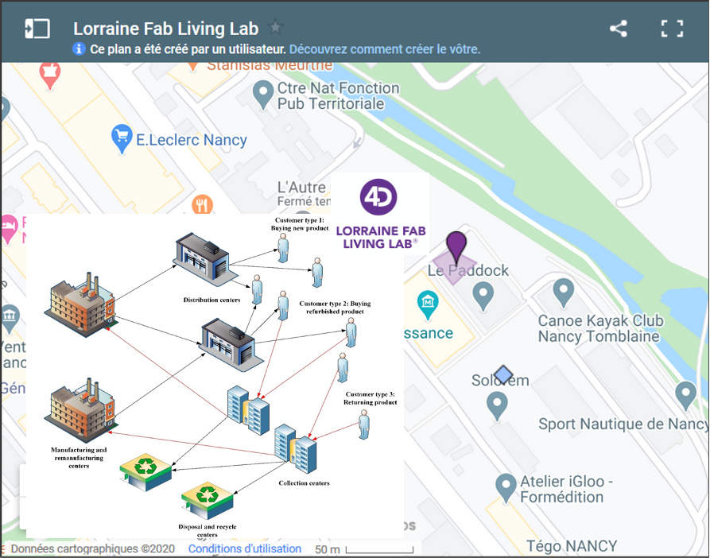

```{r share-again, echo=FALSE}
xaringanExtra::use_share_again()
```


## The problem: Plastic waste

.pull-left[ 
- US recycled less than 9% of its plastic waste.
- EU, recycled about 30%. However, this number is what is collected, not from what is in circulation*. 
- China’s ban on plastic trash
- Plastic trash could top 13 billion tons by 2050
- Economics of plastic recycling historically have been challenging
- Little financial incentive to encourage consumers to recycle their own plastic waste

## We barely recycle plastic!!.. 
]


.pull-right[ 

]


.footnote[
*Kranzinger, L., Pomberger, R., Schwabl, D., Flachberger, H., Bauer, M., Lehner, M., Hofer, W., 2018. Output-oriented analysis of the wet mechanical processing of polyolefin-rich waste for feedstock recycling. Waste Manag. Res. 36, 445–453
]


---

# Challengue

The development of sustainable industrial supply chains

.left-column[
.small[

- Only technico-economic criteria alone do not (no longer) enables a informed decision making 

- Need to assess value chains in a different way, including actual impacts on ecosystems

- A more holistic vision is needed to assess the feasibility of these new sectors.
]
 ]

.right-column[ 
.polaroid[  ]
]

---

# Towards a local distributed recycling approach


.pull-left[
- Local closed loop
- AM adds value
- Small quantities 
- Reduction of landfilling
- Minimize the use of virgin materials


]

.pull-right[


http://lf2l.fr/projects/green-fablab

.center[]

]


---


## Distributed recycling via additive manufacturing (DRAM)
Technical system

.center[]


.footnote[
Cruz Sanchez, F.A., Boudaoud, H., Camargo, M., Pearce, J.M., 2020. Plastic recycling in additive manufacturing: A systematic literature review and opportunities for the circular economy. J. Clean. Prod. 264, 121602. https://doi.org/10.1016/j.jclepro.2020.121602 
]

---

## Distributed recycling via additive manufacturing (DRAM)
Technical system --> Global system

.center[]

---

## Distributed recycling via additive manufacturing (DRAM)

Taking into account the environment and their ecosystem services (ES).

.pull-left[

]

--

.pull-right[


- How the future recycling chain could be including the environment?
]


.footnote[
Bruel, A., Kronenberg, J., Troussier, N., & Guillaume, B. (2019). Linking industrial ecology and ecological economics: A theoretical and empirical foundation for the circular economy. Journal of Industrial Ecology, 23(1), 12-21.
]

---


# Main Goals

- To develop a generic methodology to assess the ecosystem services rendered by industrial activities operating in short circuit in order to improve decision-making by industrial and public actors. 

- Validation on the case of a short-circuit plastic recycling chain.

---

# Methods

- In line with the thesis work previously carried out by the two teams, development of a coupled Systems Dynamics and LCA approach. 

- Application on a case study, the GreenFablab, by evaluating its environmental impact when setting up a short plastic recycling circuit.

.center[ ]

---

# Distributed recycling via additive manufacturing (DRAM)

Global system

.pull-left[

]

.pull-right[
- Establish and evaluate scenarios in a systemic and dynamic way

- Evaluate the influences of the main operating variables on the system

- Taking into account the priorities of the multiple stakeholders

- Facilitate your decision making public-private actors
]
.footnote[
Santander, P., Cruz Sanchez, F.A., Boudaoud, H., Camargo, M., 2020. Closed loop supply chain network for local and distributed plastic recycling for 3D printing: a MILP-based optimization approach. Resour. Conserv. Recycl. 154, 104531. https://doi.org/10.1016/j.resconrec.2019.104531 
]

---

# Delivrables

1. An article in an indexed international journal
2. Participation in an international conference 
3. An operational model with a model of a software tool for assessing local impacts
4. Final report on the evaluation of Green Fablab and possible generalisations for short industrial circuits.

---

# Valorisations

- Method and prototype of a tool for the evaluation of local impacts of circular production systems

---
class: middle, center


Thanks !


