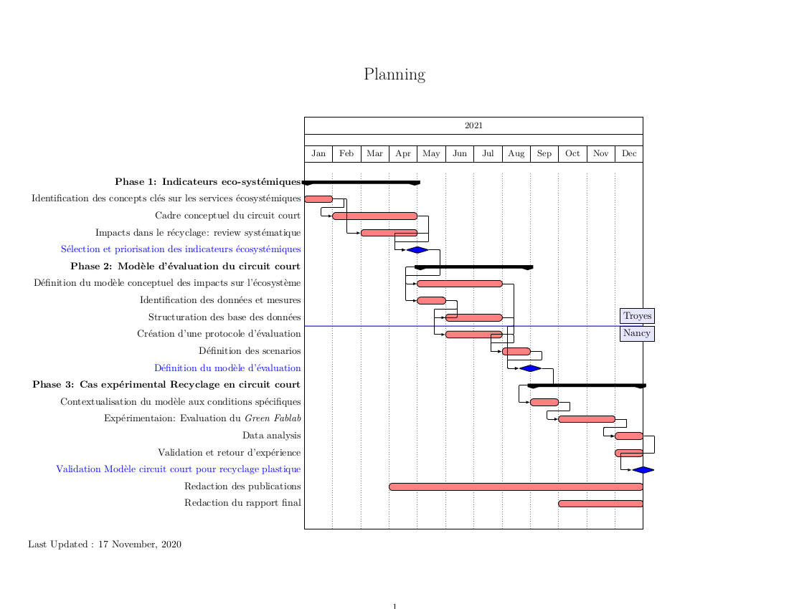

# Positionnement stratégique du projet

Dans un contexte de consommation mondiale croissante et de pression accrue sur les ressources, qui plus est, celles dédiées à la survie de l’espèce humaine, il est urgent de dissocier la croissance économique de l'utilisation de ces dernières. Ceci pourrait notamment permettre d'accroître la résistance de l'Europe aux incertitudes liées à l'approvisionnement en matières premières et à la sécurité des chaînes de valeur, comme c'est le cas actuellement avec la crise sanitaire [@Sanye-Mengual2019]. 

Il est donc temps de rendre nos filières industrielles plus résilientes et adaptées aux nouvelles conditions imposées par la planète. Pour soutenir une transition industrielle, dont celle vers une bioéconomie répondant au concept d’économie circulaire, ce projet cherche à développer une méthodologie permettant d’évaluer les services écosystémiques, et donc les externalités des organisations industrielles émergentes. Par la mise en commun de compétences du ICD/CREIDD^[Institut Charles Delaunay/Centre de recherches et d’études interdisciplinaires sur le développement durable de l'UTT (Université technologique de Troyes)]   et de l’ERPI^[  Equipe de Recherche sur les Processus Innovatifs de l’UL (Université de Lorraine)], cette méthodologie, basée sur un couplage analyse du cycle de vie et modélisation par dynamique de systèmes, cherche à faciliter l’évaluation d’un projet industriel dès sa phase amont en considérant ses potentiels impacts positifs et/ou négatifs sur son territoire. L’approche proposée sera testée sur le cas du recyclage, l’un des piliers de l’économie circulaire, et en particulier sur la mise en place d’un démonstrateur de type « smart-grid du recyclage » du plastique en circuit court. Ce projet permet également de soutenir les acteurs publics et privés par le développement d’outils d’aide à la décision supportés par les technologies numériques tel que défini dans l’axe efficacité énergétique de l’annexe 1 du texte d’appel à projet.


# Presentation


<div class="layout-chunk" data-layout="l-body">
<!--html_preserve--><div class="shareagain" style="min-width:300px;margin:1em auto;">
<iframe src="slides/index.html" width="1600" height="900" style="border:2px solid currentColor;" loading="lazy" allowfullscreen></iframe>
<script>fitvids('.shareagain', {players: 'iframe'});</script>
</div><!--/html_preserve-->

</div>


# Contenu scientifique 

Le concept d'économie circulaire (EC) est un élément central pour promouvoir un modèle durable, régénérateur et inclusif qui peut aider de manière significative nos économies à se réconcilier avec les limites et les frontières de notre planète en restaurant les systèmes naturels, en réduisant les émissions de GES (gaz à effet de serre), et en minimisant la perte de capital naturel et de biodiversité. Le fonctionnement en circuit court est l’un des piliers pour rendre les opérations d’une filière plus efficaces et rationnelles, tout en créant de la valeur locale [@Capasso2019]. 
Cependant son opérationnalisation nécessite des prises de décision qui s’avèrent difficiles, car elles challengent le paradigme actuel des activités industrielles, centrées principalement sur l’évaluation technico-économiques et, encore trop peu et trop récemment sur des considérations environnementales. En effet, la vision traditionnelle reste prégnante bien que limitée car elle ne considère pas systématiquement l’ensemble des impacts d’une activité sur les écosystèmes.
 
Comme démontré par les travaux réalisés depuis 2001 par le CREIDD sur les thématiques de l’écologie industrielle, l’éco-conception, l’analyse de cycle de vie et l’évaluation des risques environnementaux, la compréhension des mécanismes de transition industrielle en incluant des dimensions de durabilité, sont fondamentaux. De même, ils ont montré l’importance d’une vision intégrée pour la conception des systèmes industriels-territoires [@Vadoudi2014; @Vadoudi2015; @Troussier2017; @Bruel2014; @Bruel2016; @Bruel2018]. Plus récemment, des travaux ont montré que le rapprochement de l'écologie industrielle et de l’économie écologique peut être un moyen d’aller au-delà de l’étude physique des flux de matière et d’énergie [@Bruel2016]. 
En particulier dans ce projet on s’intéressera à la quantification et prise en compte des services rendus par une organisation industrielle à son territoire (espace naturel, humain et social). Ceci soulève la question des externalités environnementales et plus particulièrement des services écosystémiques rendus.


Les services écosystémiques ont été définis par [@DeGroot2002] comme la capacité des processus et des constituants de la nature à fournir des biens et services qui répondent aux besoins humains, directement ou indirectement. Ces biens et services sont généralement associés à des fonctions de régulation, des fonctions d'habitat, des fonctions de production et des fonctions d'information. Plus précisément, dans le domaine de l’environnement, les externalités négatives constituent des situations de pollutions, d’altération des ressources naturelles, de destruction de paysages, de pertes de biodiversité et d’autres nuisances environnementales qui affectent le bien-être d’individus sans que cette perte ne soit compensée par un mécanisme marchand. La plupart du temps, les externalités environnementales sont des coûts additionnels pris en charge par les autorités publiques (ex : gouvernement, collectivités territoriales) et les citoyens. Elles se matérialisent notamment par la pollution atmosphérique, les nuisances sonores, les émissions de gaz à effet de serre, la pollution des eaux et des sols, mais également par les atteintes à la biodiversité.
 
Des études soulignent que les décideurs, les développeurs de produits, les dirigeants d’entreprises, les administrateurs publics ou les consommateurs prendraient des décisions différentes s’ils avaient l’information leur permettant d’évaluer plus largement les conséquences environnementales de leurs décisions [@VandenBergh2012; @Hond2000; @Bithas2011; @ORourke1996] ou s’ils devaient également payer les prix reflétant la valeur monétaire des externalités de l’utilisation des matières et de l’énergie. Elles concluent aussi que, fondamentalement, les problèmes environnementaux sont causés par les défaillances de la réglementation et du marché qui peuvent être corrigées si les décideurs ont la bonne information et s’ils sont exposés aux bons prix.
 
De plus, les changements environnementaux sont liés à des effets de deux natures: leviers indirects et pressions directes. Par leviers indirects, le Millenium Ecosystem Assessment (MEA) [@MEA2005] adresse les changements démographiques, économiques, sociopolitiques, scientifiques et technologiques. Quant aux pressions directes, elles incluent la conversion des sols, la surexploitation des ressources naturelles, l’apport excessif de nutriments, les maladies, les invasions d’espèces et le changement climatique. Ces pressions affectent les écosystèmes de différentes manières selon les contextes et agissent à travers différentes échelles organisationnelles, temporelles et spatiales. Les systèmes industriels sont fortement impliqués et responsables des pressions qu’ils exercent sur la biodiversité et les services écosystémiques. Le MEA a identifié six défis majeurs concernant directement les impacts des activités industrielles :la rareté de l’eau douce, le changement climatique, les changements d’habitat, les espèces invasives, la surexploitation des océans et la surcharge de nutriments. Ces derniers peuvent conduire à des dépendances qui varient en fonction des secteurs d’activités et au sein même d’un même secteur, selon la technologie employée et du contexte de l’activité de production ou de consommation <span style="color:blue">*</span>.

<aside>

<span style="color:blue">*</span>Les systèmes industriels impactent de façon directe l’écosystème, notamment en occupant les sols avec leurs équipements de production et par la pollution résultant des processus de production. Ils impactent aussi de manière indirecte par l’intermédiaire de leurs fournisseurs de matières premières ou de produits semi-finis, ainsi que par les usages et fin de vie engendrés. Même si certaines entreprises considèrent ces liens comme des contraintes, les prendre en compte peut permettre de mieux appréhender les risques et d’identifier des opportunités 

</aside>


Par ailleurs, la prise en compte des services écosystémiques peut présenter de nouvelles opportunités pour les entreprises, comme favoriser l’émergence de nouvelles technologies et de nouveaux produits permettant de réduire la dégradation, de restaurer les écosystèmes ou d’augmenter l’efficacité dans l’utilisation des services écosystémiques. Cela peut aussi permettre l’obtention de nouvelles parts de marché grâce au lancement d’un nouveau produit ou service à faible impact sur les écosystèmes, donc disposant d’une éco-labellisation. Au niveau de la réglementation, on peut noter l’engagement du gouvernement, concrétisé notamment par la Stratégie Nationale pour la Biodiversité (SNB), pour développer des politiques favorables à la conservation des écosystèmes ou des incitations visant à protéger ou restaurer des écosystèmes qui fournissent des services.
L’intégration de cette relation impacts/dépendances au niveau des systèmes d’information permettrait d’avoir une autre vision des entreprises au regard de leurs activités industrielles. Cependant, elle est complexe à mettre en œuvre et spécifique à chaque secteur.
Aujourd’hui, la valeur des services écosystémiques est peu prise en compte voire pas reconnue par et dans notre système économique, que ce soit aux yeux des décideurs privés et publics ou des consommateurs. La perte de valeur causée par l’ensemble des pressions qui s’exercent sur les services écosystémiques est invisible, ce qui ne permet pas d’influencer les décideurs et de peser dans les arbitrages au niveau des processus de décisions. L’évaluation de la relation impacts/dépendances des entreprises vis-à-vis des services écosystémiques s’avère donc être un réel défi méthodologique.

Depuis 2013, l’ERPI développe le concept de Green Fablab  pour contribuer à une meilleure prise en compte des aspects environnementaux en intégrant les communautés d’utilisateurs présentes dans ces espaces de conception. 

<aside> [](http://lf2l.fr/projects/green-fablab/) </aside>  

Un premier démonstrateur a été conçu pour traiter le problème du recyclage de matières plastiques issues des déchets domestiques, adoptant une approche de type recyclage distribué en circuit court et en petites quantités ou « smart-grid du recyclage » [@Santander2020]. Plus précisément, l'enjeux était de développer une manière plus efficace de recyclage mécanique des thermoplastiques, qui sont généralement disponibles en grandes quantités au niveau local, tels que les PS, PP, ABS, PET, car le processus de recyclage traditionnel actuel s'est avéré inefficace sur le plan économique et environnemental. En effet, sous le paradigme d’économies d’échelle le recyclage est réalisé de manière centralisée en acheminant les déchets vers des unités de production capables de traiter grands volumes pour minimiser le coût. Or, la complexité de tri des multi-matériaux, la faible masse volumique qui rend le transport peu rentable et la quantité d’émissions générées par le processus de collecte expliquent cette inefficacité. Pour information en France le taux de recyclage de plastique est d’aprox. 15%.

Les travaux iniciaux, ont démontré dans un premier temps, la faisabilité technique de cette approche qui intègre plusieurs technologies (imprimantes 3D, extrudeuses et dispositifs de mesure notamment) pour fabriquer les fils supports à l’impression 3D [@CruzSanchez2017], conduisant plus récemment à un recyclage par extrusion directe [@Arthur2020]. 
Pour assurer la faisabilité économique, le système de fabrication se doit d’être peu cher, facile d’utilisation et adapté à la production de petites quantités. Pour cette raison, dès le début de leur réflexion, les chercheurs ont fait le choix d’utiliser des technologies open source [@CruzSanchez2014]. Une approche open source permet aussi de donner plus facilement accès, et ainsi diffuser plus largement des connaissances en proposant de la formation et du service autour des logiciels, valorisant le savoir-faire développé. Dans un second temps, un état de l’art approfondi a été réalisé afin de déterminer l’état de maturité de chacune des étapes constituant une approche de recyclage en circuit court [@CruzSanchez2020]. 

A ce stade des recherches, il est clair que les services écosystémiques et les externalités (positives et négatives) de cette filière de recyclage innovante n’ont pas encore été évalués. Par exemple, nous pouvons citer les effets des quantités de plastiques évités sur l’écosystème et la biodiversité, ou encore ceux des additifs chimiques (tels que les plastifiants) sur la santé humaine et animal.
Dans ce projet il s’agit donc à la fois de construire une grille d’analyse des impacts des systèmes industriels sur leur territoire à travers l’évaluation des services écosystémiques générique et appliquée au Green Fablab.
Ainsi, le projet permettra une meilleure prise en compte des externalités environnementales (écologiques et sociales) dans les processus de décision en phase amont de conception de filières industrielles. Du fait des compétences complémentaires des deux équipes, nous chercherons à mieux comprendre sur le Green Fablab quelles sont les externalités environnementales et les services écosystémiques rendus à une échelle locale au moyen d’une démarche d’Analyse de cycle de vie couplée à une modélisation en dynamique des systèmes. Cet exemple permettra de développer une méthode de collecte et interprétation des données et un outil d’évaluation des services écosystémiques associés.


# Objectif 

Développer une méthodologie générique permettant d’évaluer les services écosystémiques rendus par des activités industrielles fonctionnant en circuit court afin d’améliorer la prise de décisions des acteurs industriels et du secteur public. Validation sur le cas d’une filière de recyclage du plastique en circuit court.


# Méthodologie  

L’approche méthodologique comporte les étapes suivantes :

1.	Proposer et valider des indicateurs à utiliser pour l’évaluation des services écosystémiques d’une activité de production, et pour un fonctionnement en circuit court.
2.	Proposer un protocole de récolte et de structuration des données et information nécessaires pour évaluer un cas particulier, instrumenté dans un outil numérique pour le traitement des données et l’évaluation des impacts.
3.	Développer un modèle d'évaluation des conditions opérationnelles permettant de construire des scénarios d’évaluation d’une activité ou filière industrielle dans un contexte donné.
4.	Appliquer le modèle développé au cas du recyclage en circuit court des matières plastiques. Validation et retour d’expérience pour la prise en compte des conditions spécifiques du contexte local. 


# Résultats attendus 

- 	Cadre d’indicateurs d’évaluation des services écosystémiques pour le recyclage en circuit court permettant d’évaluer l’impact local (écologique et social) des évolutions des systèmes de production.
- 	Modèle d’évaluation des impacts sur l’écosystème d’une stratégie en circuit court par rapport à un mode de fonctionnement traditionnel.

-->	Ces deux premiers éléments seront formalisés dans un outil numérique d’évaluation des impacts environnementaux, si possible open source.

- 	Application pilote du modèle au cas du recyclage de matière plastique en mode distribué au cas du Green Fablab.
- 	Recommandations pour l’évaluation d’externalités dans le contexte de mise en place de filières industrielles en mode circuit court.

-->	Ces deux derniers éléments feront l’objet d’un rapport d’analyse des impacts du Green Fablab et des hypothèses de généralisation que l’on peut en tirer sur l’ntérêt de la mise en place de filières de production en circuits courts.


#	Détails du programme de recherche

## Rôles des partenaires:

ERPI apportera sa compétence sur la formalisation des services écosystémiques rendus par les systèmes de production sur la base d’une modélisation en dynamique de systèmes et le démonstrateur.
ICD/CREIDD apportera sa compétence sur l’évaluation des impacts écologiques et sociaux via la monétarisation des services écosystémiques.

Les deux partenaires collaboreront autour du même cas d’étude qui permettra de déployer de façon conjointe les méthodologies déjà mises au point dans le cadre de travaux de thèse dans chacun des laboratoires pour proposer un modèle d’analyse des impacts locaux (écologiques et sociaux) des transformations des systèmes de production.

##	Déroulement et phasage des travaux. Le projet se déroulera en deux phases :

<div class="layout-chunk" data-layout="l-page">
<div class="figure">

<p class="caption">(\#fig:unnamed-chunk-1)Planning</p>
</div>

</div>


### Phase 1 (6 mois postdoc) à Troyes : 

appréhender les deux propositions méthodologiques des laboratoires; proposer protocole de collecte et analyse des données; proposer le modèle d’évaluation en dynamique des systèmes (modélisation agent permettant de modéliser un système complexe et de simuler son comportement en tenant compte des interactions et rétroactions au sein du système).

### Phase 2 (6 mois postdoc) à Nancy : 

déployer la méthodologie sur le cas d’étude : collecte de données sur le Green Fablab et au sein de son territoire de développement, évaluations des services écosystémiques liés çà l’activité du Green Fablab, préconisations sur l’analyse des intérêts et limites de la mise en place des circuits industriels courts.

## Livrables et attendus

1.	Un article dans un journal international indexé
2.	Participation à une conférence internationale
3.	Un modèle opérationnel avec une maquette d’outil logiciel d’évaluation des impacts locaux
4.	Rapport final sur l’évaluation du GreenFablab et les généralisations possibles pour les circuits industriels courts.

#	Marchés visés et perspectives de transférabilité 

Les secteurs industriels et agro industriels cherchant la mise en place de stratégies centrées sur le circuit court sont particulièrement concernés notamment dans cette phase de transition post-crise qui a montré les limites des approches traditionnelles.

De même, les acteurs publics sont aujourd’hui à l'affût d’outils permettant à la fois de mieux évaluer les impacts des systèmes de production sur leur territoire et pouvoir de fait ajuster l’allocation des ressources en connaissance globale des impacts et dépendances engendrés sur l’écosystème local.

La mise en commun des compétences de l’ERPI et du CREIDD/ICD permettent donc de coupler une approche de modélisation des systèmes industriels en dynamique des systèmes avec une méthode d’évaluation des impacts environnementaux par la monétarisation des services rendus pour fournir une méthode d’évaluation des impacts locaux des circuits courts, tenant compte des fortes interactions liées aux bouclages de flux au sein du territoire.
Cette méthode et cet outil seront adapté à l’évaluation des impacts locaux de toute activité industrielle et pourront être valorisés par de la mise à disposition de savoir-faire (de modélisation de l’activité industrielle avec l’ERPI, de développement d’indicateurs d’évaluation des services écosystémiques spécifiques avec le CREIDD).


```{.r .distill-force-highlighting-css}
```
