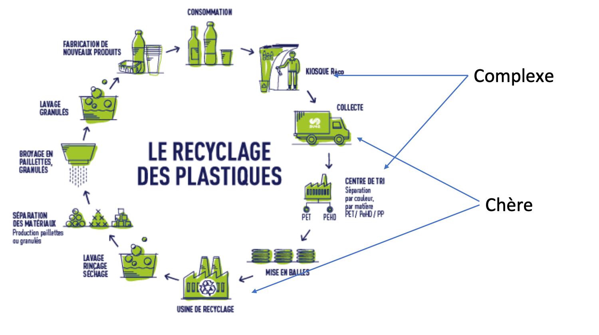

```{r setup, include = FALSE, echo=FALSE, message=FALSE}
options(htmltools.dir.version = FALSE)

knitr::opts_chunk$set(include= TRUE, echo=FALSE, message=FALSE, fig.path="figures/")

library(tidyverse)
# Link for the Figures
URL = c('https://raw.githubusercontent.com/fabbiocrux/Figures/main/')
```

```{r, include=TRUE, echo=FALSE}
# CSS for the CSS
htmltools::includeCSS("https://raw.githubusercontent.com/fabbiocrux/presentaciones/gh-pages/Assets-global/css/Fabio-fonts.css")
htmltools::includeCSS("https://raw.githubusercontent.com/fabbiocrux/presentaciones/gh-pages/Assets-global/css/Fabio.css")
```


```{r share-again, echo=FALSE}
xaringanExtra::use_share_again()
```


---

class: title-slide, left, middle
background-image: url(`r paste0(URL, 'Everest-bio/logos/Logos.png')`)
background-position: 0px 0px
background-size: contain


# `r rmarkdown::metadata$title`

## `r rmarkdown::metadata$subtitle`

### `r rmarkdown::metadata$author`

### `r rmarkdown::metadata$date`


---

class: middle, left


# Agenda

1. .content-box-yellow[Who am I?]
2. ERPI Laboratory
3. Green Fablab
4. Everest Bio
5. Proposition and Research axis


---

class: top, left
background-image: url(`r paste0(URL, 'Fabio/vosviewer/Fabio.jpg')`)
background-position: right
background-size: 70%


# Who am I?

.pull-left-1[
```{r, echo=FALSE, out.width = '60%', fig.align='center'}
knitr::include_graphics(paste0(URL, 'Fabio/Fabio.png'))
```
]

---

class: left middle

## My research questions so far...


---

class: left
background-position: 0px 75px
background-size: contain

background-image: url(`r paste0(URL, 'DRAM/DRAM-Clean-01.jpg')`)

## Are open source 3D printer good enough? 

---

## Are open source 3D printer good enough? 

Geometrical accuracy perspective

```{r , include=TRUE, echo=FALSE, fig.cap=" ", out.width = '80%', fig.align='center'}
knitr::include_graphics(paste0(URL, 'Metodologies/Master-recherche/Master-00.png'))
```

.footnote[
Cruz Sanchez, F.A., Boudaoud, H., Muller, L., Camargo, M., 2014. Towards a standard experimental protocol for open source additive manufacturing. Virtual Phys. Prototyp. 9, 151–167. https://doi.org/10.1080/17452759.2014.919553
]

---

class: left
background-image: url(`r paste0(URL, 'DRAM/DRAM-Clean-02.jpg')`)
background-position: 0px 75px
background-size: contain

## Can we print recycled objects?

Recycling feasibility (Lab conditions)

---

class: left
background-image: url(`r paste0(URL, 'DRAM/DRAM-Clean-03.jpg')`)
background-position: 0px 75px
background-size: contain

## What about the supply chain printed recycled objects?

.pull-down[Research of Pavlo Santander. Thesis Defended Dec. 2020]


---

class: left
background-image: url(`r paste0(URL, 'DRAM/DRAM-05.jpeg')`)
background-position: 100px 125px
background-size: 80%


## How an innovation lab could could help as agent of change? 

.footnote[
Roux-Marchand, T., Cruz, F., Dupont, L., Camargo, M., Osorio, F., 2020. Connecting the strategic intent of innovation labs and projects: the case of the Green Fablab, in: 2020 IEEE International Conference on Engineering, Technology and Innovation (ICE/ITMC). IEEE, pp. 1–10. https://doi.org/10.1109/ICE/ITMC49519.2020.9198320

Alexandre, A., Cruz Sanchez, F.A., Boudaoud, H., Camargo, M., Pearce, J.M., 2020. Mechanical Properties of Direct Waste Printing of Polylactic Acid with Universal Pellets Extruder: Comparison to Fused Filament Fabrication on Open-Source Desktop Three-Dimensional Printers. 3D Print. Addit. Manuf. 3dp.2019.0195. https://doi.org/10.1089/3dp.2019.0195
]


---

## What if distributed recycling could be aligned with Circular Economy priorities?

```{r, out.width = '80%', fig.align='center'}
knitr::include_graphics(paste0(URL, 'DRAM/DRAM-10.png'))
```

Cruz Sanchez, F.A., Boudaoud, H., Camargo, M., Pearce, J.M., 2020. Plastic recycling in additive manufacturing: A systematic literature review and opportunities for the circular economy. J. Clean. Prod. 264, 121602. https://doi.org/10.1016/j.jclepro.2020.121602

---

class: middle

# However...

.left-column[
```{r, out.width = '80%', fig.align='center'}
knitr::include_graphics(paste0(URL, 'Various/Signos/attention-00.png'))
```
]

.right-column[

- Technical and economic criteria alone do not (yet) allow for informed decisions. 


- Where is the environment in the techno-centrical approaches?

-  The root of the plastic waste problem needs to be addressed: the extraction and production.
-  Responsibility to act in the plastics economy

- **Adaptive injustice**: *those who find ways to adapt to changing social realities, whether forced or voluntary, are not those who are responsible for the negative changes to which they are adapting. Specifically, it is an adaptive injustice to expect communities to figure out what to do with continual flow of plastics into the economy.*

.content-box-red[**It’s time to retire this ‘privatizing profits, socializing costs’ model.**]

]


.footnote[
Conlon, K., 2020. Adaptive injustice: Responsibility to act in the plastics economy. Resour. Conserv. Recycl. 153, 104563. https://doi.org/10.1016/j.resconrec.2019.104563
]


---


class: middle

# Agenda

.pull-left[
1. Who am I?
2. .content-box-yellow[ERPI Laboratory]
3. Green Fablab
4. Everest Bio
5. Proposition and Research axis
]

.pull-right[

.brand-blue[Equipe de Recherche sur le Processus Innovatifs - ERPI]

```{r, out.width = '80%', fig.align='center'}
knitr::include_graphics('https://erpi.univ-lorraine.fr/assets/images/logo-ERPI.svg')
```
]


---


## .small[Equipe de Recherche sur le Processus Innovatifs - ERPI] 

A .red[Multidisciplinary] team in **Industrial Engineering** specialized in the study of Innovation processes


.pull-left[

```{r, out.width = '95%', fig.align='center'}
knitr::include_graphics('https://erpi.univ-lorraine.fr/assets/images/logo-ERPI.svg')
```


45 Members average

24 permanent researchers <br>
(10 full Pr., 13 associated Pr, 1 Research engineer) <br>
1 Studies engineer <br>
5 Postdoc  <br>
3 Temporary lecturers  <br>
2 Admin. <br>

]

.pull-right[

```{r, out.width = '95%', fig.align='center'}
knitr::include_graphics(paste0(URL, 'LF2L/Methodology-complet-00.jpg'))
```

Research platform: **LF2L** - http://lf2l.fr
]


---

# Research domains at ERPI: 

.pull-left[
.pull-left[
```{r, out.width = '95%', fig.align='center'}
knitr::include_graphics(paste0(URL, 'ERPI/Presentation/01-Innovation-metrology.jpg'))
```

.orange[
**Innovation capability**

Product <br>
Process  <br>
Business Model <br>

]
]
.pull-right[
```{r, out.width = '95%', fig.align='center'}
knitr::include_graphics(paste0(URL, 'ERPI/Presentation/02-Prospective.jpg'))
```
.blue[
**Technological  Emergence/maturity**

Product-Process <br>
Industrial supply chain <br>
]]]

.pull-right[
.pull-left[
```{r, out.width = '95%', fig.align='center'}
knitr::include_graphics(paste0(URL, 'ERPI/Presentation/03-Design.jpg'))
```
.green[
**Materialized**

Creative Exploration <br>
Feasibility Product-Process <br>
Physic & digital (virtual) Prototyping <br>
]
]
.pull-right[
```{r, out.width = '95%', fig.align='center'}
knitr::include_graphics(paste0(URL, 'ERPI/Presentation/04-Acceptability.jpg'))
```
.purple[
**Front-end validation**
Multi-actors Acceptability <br>
User eXperience & test by use <br>
Living Lab <br>
]]]

.center.Large[Creator of **methods & tools** supporting innovation process]

---

## Scope: The Fuzzy Front End of innovation 

.pull-left[
```{r, out.width = '95%', fig.align='center'}
knitr::include_graphics(paste0(URL, 'ERPI/Presentation/Scope-00.jpg'))
```
]

.pull-right[
```{r, out.width = '95%', fig.align='center'}
knitr::include_graphics(paste0(URL, 'ERPI/Presentation/Purpose-00.jpg'))
```
.footnote[
Martinez-Hernandez, E., 2017. Trends in sustainable process design—from molecular to global scales. Curr. Opin. Chem. Eng. 17, 35–41. <br/> https://doi.org/10.1016/j.coche.2017.05.005 
]
]

Think earlier in the sustainable design and their impact


---

## Innovation: a response to current social challenges

```{r, out.width = '95%', fig.align='center'}
knitr::include_graphics(paste0(URL, 'ERPI/Presentation/Fields-00.jpg'))
```

.tiny[Tran Thi Hoang, G., Dupont, L., & Camargo, M. (2019). Application of Decision-Making Methods in Smart City Projects: A Systematic Literature Review. Smart Cities, 2(3), 433-452.]

---

class: middle

# Agenda

.pull-left[
1. Who am I?
2. ERPI Laboratory
3. .content-box-yellow[Green Fablab]
4. Everest Bio
5. Proposition and Research axis
]

.pull-right[

```{r, out.width = '100%', fig.align='center'}
knitr::include_graphics('http://lf2l.fr/assets/images/3-projects/gf/Logo-GF.png')
```
*Circular economy and 3D printing: Towards a distributed recycling paradigm*
]


---

class: top, left
background-image: url(`r paste0(URL, 'Plastics/Plastic-problem-03.svg')`)
background-position: right
background-size: 70% 

## Plastics waste since  olden times


.left-column[
.tiny[
- US recycled less than 9% of its plastic waste.
- EU, recycled about 30%. However, this number is what is collected, not from what is in circulation*. 
- China’s ban on plastic trash
- Plastic trash could top 13 billion tons by 2050
- Economics of plastic recycling historically have been challenging
- Little financial incentive to encourage consumers to recycle their own plastic waste

```{r, out.width = '60%', fig.align='center'}
knitr::include_graphics('https://images.unsplash.com/photo-1537084642907-629340c7e59c?ixlib=rb-1.2.1&ixid=eyJhcHBfaWQiOjEyMDd9&auto=format&fit=crop&w=1567&q=80')
```

]]

.footnote[
Geyer, R., Jambeck, J.R., Law, K.L., 2017. Production, use, and fate of all plastics ever made. Sci. Adv. 3, e1700782. https://doi.org/10.1126/sciadv.1700782

*Kranzinger, L., Pomberger, R., Schwabl, D., Flachberger, H., Bauer, M., Lehner, M., Hofer, W., 2018. Output-oriented analysis of the wet mechanical processing of polyolefin-rich waste for feedstock recycling. Waste Manag. Res. 36, 445–453

]


---

# Challengue

The development of sustainable industrial supply chains

.left-column[
.footnotesize[
- Only technico-economic criteria alone do not (no longer) enables a informed decision making 
- Need to assess value chains in a different way, including actual impacts on ecosystems
- A more holistic vision is needed to assess the feasibility of these new sectors.
]
 ]

.right-column[ 
.polaroid[  ]
]

---

## Green Fablab: Towards a distributed recycling via additive manufacturing (DRAM)

.pull-left[

-Local closed loop  <br>
-AM adds value  <br>
-Small quantities   <br>
-Reduction of landfilling  <br>
-Minimize the use of virgin materials  <br>

```{r, include=TRUE, echo=FALSE, fig.cap=" ", out.width = '100%', fig.align='left'}
knitr::include_graphics(paste0(URL, 'Green-Fablab/Green-fablab-2.jpg'))
```

]
.pull-right[

```{r, include=TRUE, echo=FALSE, out.width = '100%', fig.align='center'}
knitr::include_graphics(paste0(URL, 'Green-Fablab/Green-fablab-1.jpg'))
```

http://lf2l.fr/projects/green-fablab
]


.footnote[
Cruz Sanchez, F.A., Boudaoud, H., Muller, L., Camargo, M., 2014. Towards a standard experimental protocol for open source additive manufacturing. Virtual Phys. Prototyp. 9, 151–167. https://doi.org/10.1080/17452759.2014.919553
]


---

## Green Fablab: Towards a distributed recycling via additive manufacturing (DRAM)


.left-column[ 
Small scale: 2 km radius (neighbourhood scale) <br>
Low processing capacity, <br>
Technologies: cheap, easy to use <br>
Active role of users <br>

```{r, include=TRUE, echo=FALSE, out.width = '100%', fig.align='center'}
knitr::include_graphics('figures/GF-users.jpg')
```
]

.right-column[ 
.center[]

]

---


class: middle

# Agenda

.pull-left[
1. Who am I?
2. ERPI Laboratory
3. Green Fablab
4. .content-box-yellow[Everest Bio]
5. Proposition and Research axis
]

.pull-right[

```{r, out.width = '100%', fig.align='center'}
knitr::include_graphics(paste0(URL, 'Everest-bio/logos/logo-2.jpg'))
```
]


---

## People in Everest Bio

.pull-left[
```{r, out.width = '500px', fig.align='center'}
knitr::include_graphics(paste0(URL, 'Everest-bio/Mauricio.jpg'))
```

```{r, out.width = '500px', fig.align='center'}
knitr::include_graphics(paste0(URL, 'Everest-bio/Hakim.jpg'))
```

```{r, out.width = '500px', fig.align='center'}
knitr::include_graphics(paste0(URL, 'Everest-bio/Fedoua.jpg'))
```

```{r, out.width = '500px', fig.align='center'}
knitr::include_graphics(paste0(URL, 'Everest-bio/Pavlo.jpg'))
```

]

.pull-right[
```{r, out.width = '500px', fig.align='center'}
knitr::include_graphics(paste0(URL, 'Everest-bio/Nadege.jpg'))
```

```{r, out.width = '500px', fig.align='center'}
knitr::include_graphics(paste0(URL, 'Everest-bio/Alexis.jpg'))
```

```{r, out.width = '500px', fig.align='center'}
knitr::include_graphics(paste0(URL, 'Everest-bio/Cristian.jpg'))
```

]

---

## Research Question & Goal

- To develop a generic methodology to assess the **ecosystem services** rendered by industrial activities operating in short circuit in order to improve decision-making by industrial and public actors. 

- Validation on the case of a short-circuit plastic recycling chain.


---

## Methodology

- In line with the thesis work previously carried out by the two teams, development of a coupled **Systems Dynamics and LCA approach**. 

- Application on a case study, the Green Fablab, by evaluating its environmental impact when setting up a short plastic recycling circuit.

.center[ ]


---

## Purpose of Everest Bio

Taking into account the environment and their ecosystem services (ES).

.pull-left[

```{r, out.width = '90%', fig.align='center'}
knitr::include_graphics(paste0(URL, 'Ecoservices/Eco-Services-00.jpg'))
```
]


.pull-right[


- How the future recycling chain could be including the environment?
]


.footnote[
Bruel, A., Kronenberg, J., Troussier, N., & Guillaume, B. (2019). Linking industrial ecology and ecological economics: A theoretical and empirical foundation for the circular economy. Journal of Industrial Ecology, 23(1), 12-21.
]

---

class: middle

### Ecosystem Services as a **boundary object** for sustainability

.pull-left[

In that sense, Our focus is towards becoming an explicit management tool: 

- Creating Systems, Normative and Transformative knowledge using as case study distributed recycling

- better interdisciplinary knowledge integration, greater focus on normative knowledge, and improved recognition of the ecosystem services concept as a potential transformative tool.

]

.pull-right[
```{r, out.width = '90%', fig.align='center'}
knitr::include_graphics(paste0(URL, 'Ecoservices/Abson2014-00.jpg'))
```
]

.footnote[
Abson, D.J., von Wehrden, H., Baumgärtner, S., Fischer, J., Hanspach, J., Härdtle, W., Heinrichs, H., Klein, A.M., Lang, D.J., Martens, P., Walmsley, D., 2014. Ecosystem services as a boundary object for sustainability. Ecol. Econ. https://doi.org/10.1016/j.ecolecon.2014.04.012
]

---

class: top, left
background-image: url(`r paste0(URL, 'Ecoservices/Vanderwilde2021-01.jpg')`)
background-position: 290px 0px
background-size: 75% 


### We look to connect <br> Ecosystem services and LCA 

Hoping to contributing in <br> sustainability uncertainties.

.footnote[
Vanderwilde, C.P., Newell, J.P., 2021. Ecosystem services and life cycle assessment: A bibliometric review. https://doi.org/10.1016/j.resconrec.2021.105461 <br>
Diwekar, U., Amekudzi-Kennedy, A., Bakshi, B., Baumgartner,et al, 2021. A perspective on the role of uncertainty in sustainability science and engineering. Resour. Conserv. Recycl. 164, 105140. https://doi.org/10.1016/j.resconrec.2020.105140
]


---

### Systems Dynamics of DRAM

Technical system --> Global *system* embedded in a *territory*!

```{r, out.width = '90%', fig.align='center'}
knitr::include_graphics(paste0(URL, 'DRAM/DRAM-Territory-00.jpg'))
```


---


## Towards systemic solutions

Global system

.pull-left[
```{r, out.width = '100%', fig.align='center'}
knitr::include_graphics(paste0(URL, 'DRAM/DRAM-08.png'))
```

]

.pull-right[
- Establish and evaluate scenarios in a systemic and dynamic way
- Evaluate the influences of the main operating variables on the system taking ecosystem services boundaries
- Taking into account the priorities of the multiple stakeholders
- Facilitate your decision making public-private actors
]


.footnote[
Santander, P., Cruz Sanchez, F.A., Boudaoud, H., Camargo, M., 2020. Closed loop supply chain network for local and distributed plastic recycling for 3D printing: a MILP-based optimization approach. Resour. Conserv. Recycl. 154, 104531. https://doi.org/10.1016/j.resconrec.2019.104531 
]

---

# Delivrables & Valorisations

1. An article in an indexed international journal
2. Participation in an international conference 
3. An operational model with a model of a software tool for assessing local impacts
4. Final report on the evaluation of Green Fablab and possible generalisations for short industrial circuits.

- Method and [**prototype of a tool**](https://fabbiocrux.github.io/everest-bio-tool/) for the evaluation of local impacts of circular production systems

---


---

class: middle, left
background-image: url(`r paste0(URL, 'Climatelabs/Climatelabs.png')`)
background-position: center
background-size: contain

---
class: middle

# EU projects 

.pull-left[
```{r , include=TRUE, echo=FALSE, fig.cap=" ", out.width = '60%', fig.align='center'}
knitr::include_graphics(paste0(URL, 'Smagrinet/Smagrinet-00.jpg'))
```
https://www.smagrinet.eu/

```{r , include=TRUE, echo=FALSE, fig.cap=" ", out.width = '60%', fig.align='center'}
knitr::include_graphics(paste0(URL, 'Digiterri/Digiterri'))
```

https://digiterri.eu/

] 
.pull-right[

```{r , include=TRUE, echo=FALSE, fig.cap=" ", out.width = '100%', fig.align='center'}
knitr::include_graphics(paste0(URL, 'Inedit/Inedit-00.png'))
```

https://www.inedit-project.eu/
]


---


class: middle, center

Thanks !


