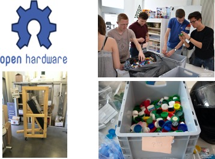
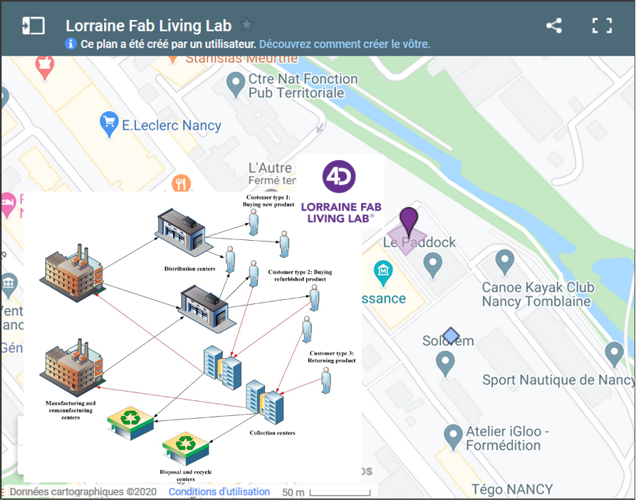
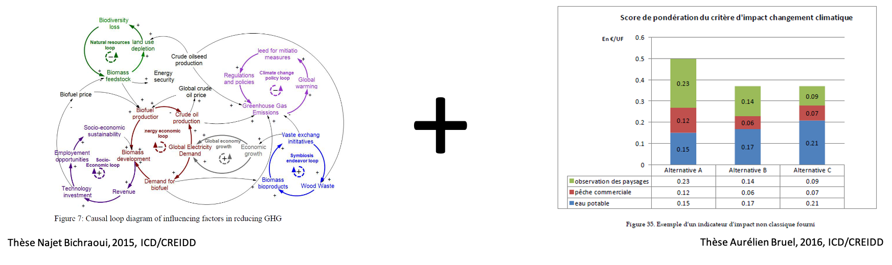
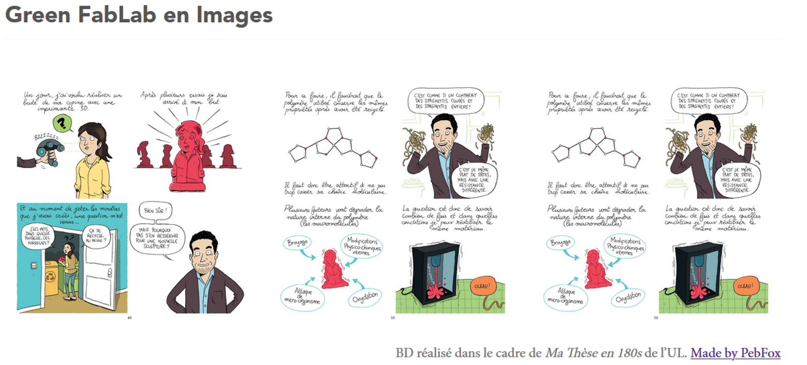

```{r setup, include = FALSE, echo=FALSE, message=FALSE}
options(htmltools.dir.version = FALSE)
source("xaringan-themer.R")

library(vembedr)

knitr::opts_chunk$set(
   include = TRUE,
  fig.width=9, fig.height=3.5, fig.retina=3,
  fig.path="figures/",
  out.width = "100%",
  fig.align = 'center',
  cache = FALSE,
  echo = FALSE,
  message = FALSE, 
  warning = FALSE,
  fig.show = TRUE,
  hiline = TRUE
)


# Link for the Figures
URL = c('https://raw.githubusercontent.com/fabbiocrux/Figures/main/')

# CICES File
#file_cices <- list.files("../data/CICES")
CICES <- read_excel(here("../data/CICES/Finalised-V5.1_18032018.xlsx"), sheet = "CICES V5.1",  skip = 4 )
```


class: title-slide, left, middle
background-image: url(`r paste0(URL, 'Everest-bio/logos/Logos.png')`)
background-position: 0px 0px
background-size: contain

<br>
# `r rmarkdown::metadata$title`

## `r rmarkdown::metadata$subtitle`

### `r rmarkdown::metadata$author`

###**L'ingénierie et le management de l'innovation au service de la transformation des territoires**

### `r Sys.Date()`


---

exclude: true
class: middle

# Agenda

.pull-left[
1. Who am I?
2. ERPI Laboratory
3. .content-box-yellow[Green Fablab]
4. Everest Bio
5. Proposition and Research axis
]

.pull-right[

```{r, out.width = '100%', fig.align='center'}
knitr::include_graphics('http://lf2l.fr/assets/images/3-projects/gf/Logo-GF.png')
```
*Circular economy and 3D printing: Towards a distributed recycling paradigm*
]


---

class: middle, left
background-image: url(`r paste0(URL, 'Plastics/Plastic-problem-03.svg')`)
background-position: 100% 20%
background-size: 70% 

.left[
## Plastics waste
]


.footnote[
- Geyer, R., Jambeck, J.R., Law, K.L., 2017. Production, use, and fate of all plastics ever made. Sci. Adv. 3, e1700782. https://doi.org/10.1126/sciadv.1700782

<!-- - Kranzinger, L., Pomberger, R., Schwabl, D., Flachberger, H., Bauer, M., Lehner, M., Hofer, W., 2018. Output-oriented analysis of the wet mechanical processing of polyolefin-rich waste for feedstock recycling. Waste Manag. Res. 36, 445–453 -->

]


---

class: bg-gf middle 

# Green Fablab: 
## .bg-green[ a demostrotar of: <br>*'design global, manufacturing [recycling] local'*]

---

# Green Fablab: 

.pull-left[

-Local closed loop  <br>
-AM adds value  <br>
-Small quantities   <br>
-Reduction of landfilling  <br>
-Minimize the use of virgin materials  <br>

```{r, include=TRUE, echo=FALSE, fig.cap=" ", out.width = '100%', fig.align='left'}
knitr::include_graphics(paste0(URL, 'Inedit/INEDIT-logo-00.jpg'))
```

http://lf2l.fr/projects/green-fablab
]

.pull-right[
```{r}
embed_youtube(
  "sJfIU2uE7Zs",
  width = 400,
  height = 500,
  ratio = "4by3",
  frameborder = 0,
  allowfullscreen = TRUE,
)
```
]

---

# Green Fablab: 

.pull-left[


```{r, include=TRUE, echo=FALSE, fig.cap=" ", out.width = '100%', fig.align='left'}
knitr::include_graphics(paste0(URL, 'Green-Fablab/Green-fablab-2.jpg'))
```

]
.pull-right[


]


.footnote[
Cruz Sanchez, F.A., Boudaoud, H., Muller, L., Camargo, M., 2014. Towards a standard experimental protocol for open source additive manufacturing. Virtual Phys. Prototyp. 9, 151–167. https://doi.org/10.1080/17452759.2014.919553
]


---

## Green Fablab

.left-column[ 
Small scale: 2 km radius (neighbourhood scale) <br>
Low processing capacity, <br>
Technologies: cheap, easy to use <br>
Active role of users <br>

```{r, include=TRUE, echo=FALSE, out.width = '100%', fig.align='center'}

```
]

.right-column[ 
.center[]

]

---

exclude: true

class: middle

# Agenda

.pull-left[
1. Who am I?
2. ERPI Laboratory
3. Green Fablab
4. .content-box-yellow[Everest Bio]
5. Proposition and Research axis
]

.pull-right[

```{r, out.width = '100%', fig.align='center'}
knitr::include_graphics(paste0(URL, 'Everest-bio/logos/logo-2.jpg'))
```
]


---
background-image: url(`r paste0(URL, 'Recycling/Polymer-recycling-02.png')`)
background-position: 50% 100%
background-size: 60%

# Challengue

The development of sustainable industrial supply chains


- Only **.red[tech-economic criteria]** alone do not (no longer) enables a .orange[informed decision making]. 
- Need to assess value chains in a different way, including **actual impacts on ecosystems**
- A more holistic vision is needed to assess the feasibility of these new bottom-up sectors for **territorial and industrial agents**.


---

## Research Question & Goal

- To develop a generic methodology to assess the **ecosystem services** rendered by industrial activities operating in short circuit in order to improve decision-making by industrial and public actors. 

- Validation on the case of a short-circuit plastic recycling chain.


---

## Methodology

- In line with the thesis work previously carried out by the two teams, development of a coupled **Systems Dynamics and LCA approach**. 

- Application on a case study, the Green Fablab, by evaluating its environmental impact when setting up a short plastic recycling circuit.

.center[ ]


---

## Purpose of the project

Taking into account the environment and their ecosystem services (ES).

.pull-left[

```{r, out.width = '90%', fig.align='center'}
knitr::include_graphics(paste0(URL, 'Ecoservices/Eco-Services-00.jpg'))
```
]


.pull-right[


- How the future recycling chain could be including the environment?
]


.footnote[
Bruel, A., Kronenberg, J., Troussier, N., & Guillaume, B. (2019). Linking industrial ecology and ecological economics: A theoretical and empirical foundation for the circular economy. Journal of Industrial Ecology, 23(1), 12-21.
]

---

class: middle

### Ecosystem Services as a **boundary object** for sustainability

.pull-left[

In that sense, Our focus is towards becoming an explicit management tool: 

- Creating Systems, Normative and Transformative knowledge using as case study distributed recycling

- better interdisciplinary knowledge integration, greater focus on normative knowledge, and improved recognition of the ecosystem services concept as a potential transformative tool.

]

.pull-right[
```{r, out.width = '90%', fig.align='center'}
knitr::include_graphics(paste0(URL, 'Ecoservices/Abson2014-00.jpg'))
```
]

.footnote[
Abson, D.J., von Wehrden, H., Baumgärtner, S., Fischer, J., Hanspach, J., Härdtle, W., Heinrichs, H., Klein, A.M., Lang, D.J., Martens, P., Walmsley, D., 2014. Ecosystem services as a boundary object for sustainability. Ecol. Econ. https://doi.org/10.1016/j.ecolecon.2014.04.012
]

---

class: top, left
background-image: url(`r paste0(URL, 'Ecoservices/Vanderwilde2021-01.jpg')`)
background-position: 290px 0px
background-size: 75% 


### We look to connect <br> Ecosystem services and LCA 

Hoping to contributing in <br> sustainability uncertainties.

.footnote[
Vanderwilde, C.P., Newell, J.P., 2021. Ecosystem services and life cycle assessment: A bibliometric review. https://doi.org/10.1016/j.resconrec.2021.105461 <br>
Diwekar, U., Amekudzi-Kennedy, A., Bakshi, B., Baumgartner,et al, 2021. A perspective on the role of uncertainty in sustainability science and engineering. Resour. Conserv. Recycl. 164, 105140. https://doi.org/10.1016/j.resconrec.2020.105140
]


---

### Systems Dynamics of DRAM

Technical system --> Global *system* embedded in a *territory*!

```{r, out.width = '90%', fig.align='center'}
knitr::include_graphics(paste0(URL, 'DRAM/DRAM-Territory-00.jpg'))
```


---

## Towards systemic solutions

Global system

.pull-left[
```{r, out.width = '100%', fig.align='center'}
knitr::include_graphics(paste0(URL, 'DRAM/DRAM-08.png'))
```

]

.pull-right[
- Establish and evaluate scenarios in a systemic and dynamic way
- Evaluate the influences of the main operating variables on the system taking ecosystem services boundaries
- Taking into account the priorities of the multiple stakeholders
- Facilitate your decision making public-private actors
]


.footnote[
Santander, P., Cruz Sanchez, F.A., Boudaoud, H., Camargo, M., 2020. Closed loop supply chain network for local and distributed plastic recycling for 3D printing: a MILP-based optimization approach. Resour. Conserv. Recycl. 154, 104531. https://doi.org/10.1016/j.resconrec.2019.104531 
]

---


exclude: true
## People in Everest Bio

.pull-left[
```{r, out.width = '500px', fig.align='center'}
knitr::include_graphics(paste0(URL, 'Everest-bio/Mauricio.jpg'))
```

```{r, out.width = '500px', fig.align='center'}
knitr::include_graphics(paste0(URL, 'Everest-bio/Hakim.jpg'))
```

```{r, out.width = '500px', fig.align='center'}
knitr::include_graphics(paste0(URL, 'Everest-bio/Fedoua.jpg'))
```

```{r, out.width = '500px', fig.align='center'}
knitr::include_graphics(paste0(URL, 'Everest-bio/Pavlo.jpg'))
```

]

.pull-right[
```{r, out.width = '500px', fig.align='center'}
knitr::include_graphics(paste0(URL, 'Everest-bio/Nadege.jpg'))
```

```{r, out.width = '500px', fig.align='center'}
knitr::include_graphics(paste0(URL, 'Everest-bio/Alexis.jpg'))
```

```{r, out.width = '500px', fig.align='center'}
knitr::include_graphics(paste0(URL, 'Everest-bio/Cristian.jpg'))
```

]
---
# Delivrables & Valorisations

1. An article in an indexed international journal
2. Participation in an international conference 
3. An operational model with a model of a software tool for assessing local impacts
4. Final report on the evaluation of Green Fablab and possible generalisations for short industrial circuits.

- Method and [**prototype of a tool**](https://fabbiocrux.github.io/everest-bio-tool/) for the evaluation of local impacts of circular production systems


---
class: middle, center

# Thanks !




